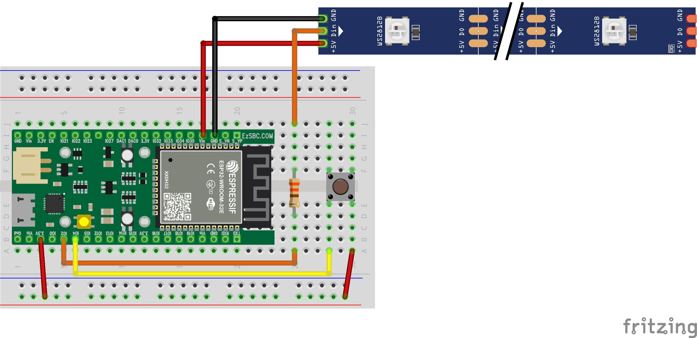

# Note: Wiring

It is quite possible to fry your ESP32 or LED strip if you're not careful with wiring.
Please adhere to these general guidelines:

- Always double-check your wiring before connecting the ESP32 to power (e.g. USB).
- Wire the ESP32 while it is disconnected from power/USB.
- Always connect ground (`GND`) **first** and only then the live pins (`3.3V` or `5V`/`VIN`). When disconnecting, do it
  in reverse order.
- Never short live pins to ground, i.e. you should always have a resisting component in between (e.g. a resistor or
  LED).
- The metal housing on the ESP32 is also grounded, so be careful not to let any wires dangle and touch it.

##### Especially regarding 5V:

When powering the ESP32 via USB, we give it 5V. Internally, this is regulated down to 3.3V - the operating voltage of
the ESP32.
When doing so, the `VIN` pin can be used to draw 5V directly from USB, bypassing the regulator. We will use this to
power the LED strip.

**Never mix 3.3V and 5V**. Each component has its rated voltage level.

If you go below that, you will most likely see weird behavior (e.g. you *can* power the LED strip via 3.3V, but it will
be dimmer). If you go above it, you will most likely damage some hardware.
For example, the ESP32 can only work with 3.3V. Therefore, **NEVER**
connect the `VIN` pin to *any* other pin on the ESP32 except for ground.

### Wiring diagram

Choose the GPIO pins as you please, this is just an example (but adjust the Menuconfig).
In the diagram, the button isn't pulled to a fixed voltage level, which means the signal is *floating*, i.e. you won't
get any reliable readings.
Either add a resistor pulling the signal down to ground, or use the internal pull-down resistor of the ESP32. You can of
course also do the opposite: connect via ground and pull up to 3.3V.

Notes regarding the LED strip:

- The 5V go directly to the LED strip, not through the breadboard. We reserve the breadboard for the nice and safe 3.3V
  logic :)
- The data line goes through a resistor (~330 Ohm). This smooths out the signal and makes it more reliable.

